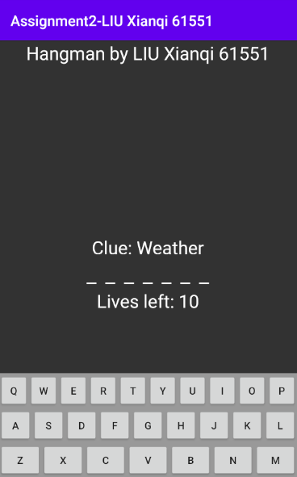
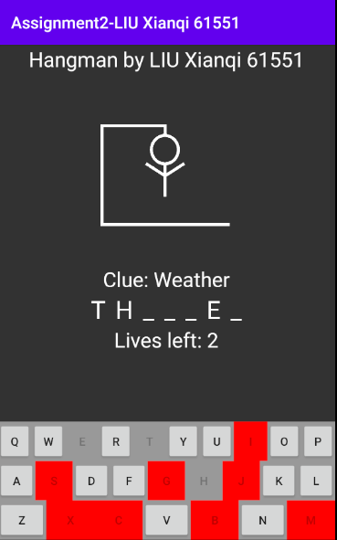
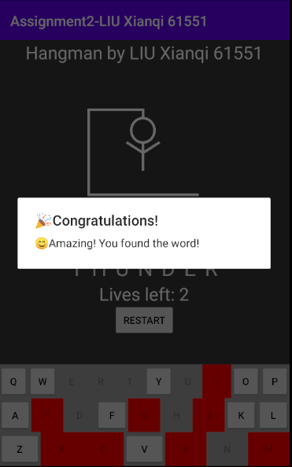
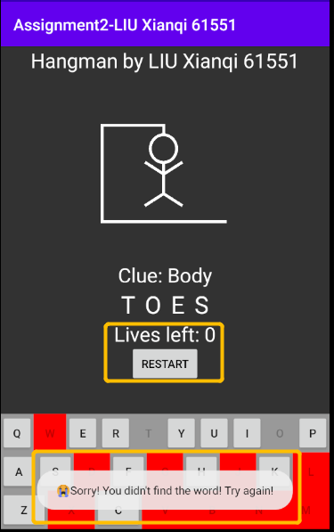

Assignment2-Hangman
by LIU Xianqi 61551

1.About the words file and data preparation
I got the inspiration from a real game 'Hangman' in Apple store.
Then I put the word that I didn't find out into the 'words_and_clues.csv', which follow the format as [word,clue].
Thus, I use a hashmap to store them, which make words as keys and make their clues as values.

2.Game begin
- The number of '_' represents the length of the hidden word.
- Above the hidden word, there's a clue help user to take a guess.
- Under the hidden word, there's text displaying how many lives left(10 left at the beginning).
- The bottom of the activity is the keyboard designed and created by me.
  Idea: I store 'a-z' as array in the resource, then dynamically generate them in the JAVA code.
- During the game, if user click the wrong letter, the picture above will change.
  Besides, the clicked buttons' background will be changed and disabled to prevent further unintentionally clicks.
-
 
  
3.Game over
- If you find the hidden word successfully, you will receive a alert message 🎉! 
  And touch the space outside the alert dialog, the dialog will disappear.
- If you fail after 10 attempts, the picture will be a completed hangman :( but also you could see what exactly the word is.
  And you will receive a toast message. 
- Besides, when the game overs, the restart button will be visible, after clicking that you will begin with new word to guess.
- 
 
